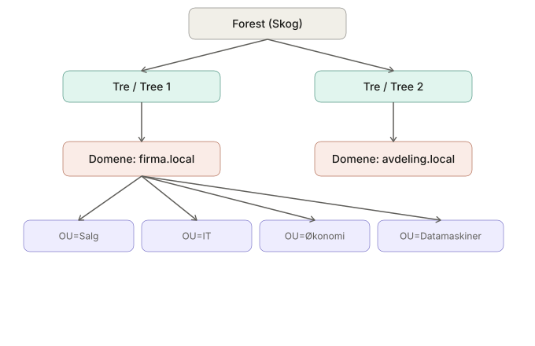
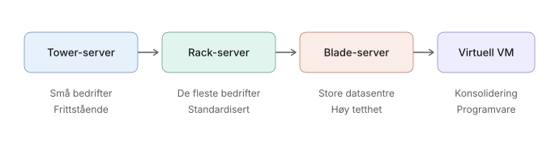
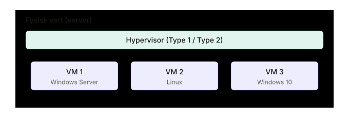
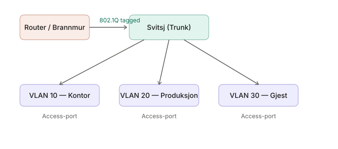
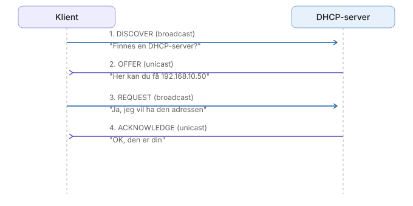
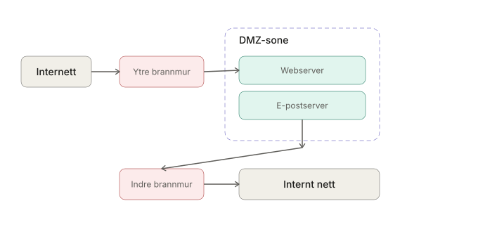
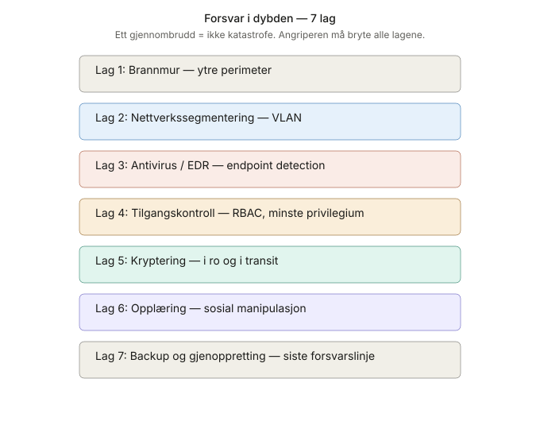
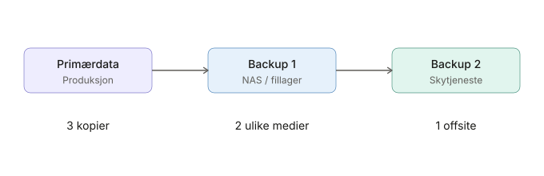
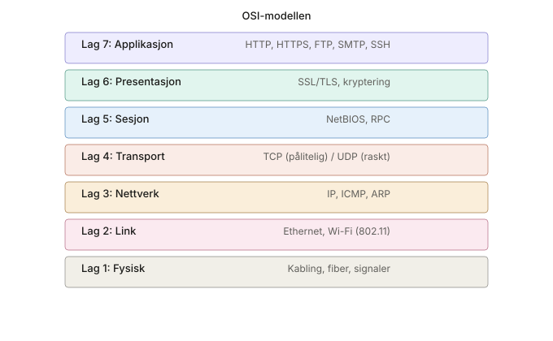

# Eksamensrepetisjon — Driftsstøtte VG2

En kortfattet repetisjonsguide basert på fagets pensum. Strukturert etter tema med visuelle diagrammer og huskepunkter. Bruk sammen med notatene på [olewol.github.io/driftsstotte-vg2/](https://olewol.github.io/driftsstotte-vg2/).

---

## 1. BRUKERADMINISTRASJON

Brukeradministrasjon handler om å styre hvem som har tilgang til hva i et nettverk. I Windows-miljøer gjøres dette via Active Directory — en katalogtjeneste som lagrer informasjon om brukere, maskiner og tilganger sentralt.

### Sentrale begreper

| Begrep | Forklaring |
|--------|------------|
| **Katalogtjeneste** | Sentral database over brukere, maskiner og tilganger (Active Directory / Entra ID) |
| **AD DS** | Microsofts katalogtjeneste for Windows-miljø |
| **Entra ID** | Microsofts skybaserte katalogtjeneste (tidligere Azure AD) |
| **OU** | Organisasjonsenhet — logisk beholder for brukere/maskiner i AD |
| **Domene** | Grunnenheten i AD, identifiseres med DNS-navn (f.eks. firma.local) |
| **SID** | Security Identifier — unik ID for hver bruker/gruppe i Windows |
| **GPO** | Group Policy Object — sentral innstilling som distribueres til OU-er |
| **LDAP** | Protokollen AD bruker for katalogtilgang |
| **Kerberos** | Standard autentiseringsprotokoll i AD (sikrere enn NTLM) |

### AD-hierarkiet

Active Directory er bygget opp som et trestruktur-hierarki. Øverst står skogen (forest), som kan inneholde flere trær og domener.



```text
                        ┌──────────────────┐
                        │  Skog / Forest    │
                        └────────┬─────────┘
                                 │
              ┌──────────────────┼──────────────────┐
              │                  │                  │
     ┌────────┴────────┐  ┌─────┴──────┐
     │   Tre / Tree 1  │  │ Tre / Tree 2│
     └────────┬────────┘  └─────┬──────┘
              │                 │
     ┌────────┴────────┐  ┌─────┴──────────────┐
     │ firma.local     │  │ avdeling.local     │
     │ (domene)        │  │ (domene)           │
     └────────┬────────┘  └────────────────────┘
              │
    ┌─────────┼─────────┬──────────┬──────────┐
    │         │         │          │          │
┌───┴───┐ ┌──┴───┐ ┌──┴────┐ ┌───┴────┐ ┌──┴─────┐
│OU=Salg│ │OU=IT │ │OU=Øko │ │OU=Data-│ │OU=Grupp│
│       │ │      │ │nomi   │ │maskiner│ │er      │
└───────┘ └──────┘ └───────┘ └────────┘ └────────┘
```

### Best Practice — OU-struktur

En god OU-struktur gjør det enklere å administrere GPO-er og tilganger. Her er et anbefalt oppsett:

```text
firma.local
├── OU=Brukere
│   ├── OU=AvdelingA
│   ├── OU=AvdelingB
│   └── OU=AvdelingC
├── OU=Datamaskiner
│   ├── OU=Kontor
│   └── OU=Felt
└── OU=Grupper
    ├── OU=Sikkerhetsgrupper
    └── OU=Distribusjonsgrupper
```

### Rollebasert tilgang (RBAC)

RBAC går ut på å gruppere brukere etter rolle og gi tillatelser til gruppene — ikke til enkeltpersoner.

> **Hovedregel:** ALDRI tildel tillatelser til enkeltbrukere. Opprett alltid en sikkerhetsgruppe, legg brukeren i gruppen, og tildel tillatelser til gruppen.

1. Opprett sikkerhetsgrupper per rolle: `SG_Admin`, `SG_Salg`, `SG_Logistikk`
2. Plasser brukere i riktig gruppe
3. Tildel tillatelser til gruppen
4. **Prinsippet om minste privilegium**: gi kun tilgangene som trengs

### Husk til eksamen

- Domenekontroller (DC) = server med AD DS. Du trenger **minst 2** for redundans

- Uten DNS fungerer ikke AD-pålogging
- Kerberos > NTLM: passordet sendes aldri over nettverket
- Slett aldri konto ved oppsigelse — **deaktiver** kontoen (bevarer SID, e-post, data)

- UAC hindrer programmer i å kjøre som administrator uten godkjenning

---

## 2. INFRASTRUKTUR OG MASKINVARE

For å bygge et bedriftsnettverk trenger du flere typer maskinvare som jobber sammen. Her er de viktigste komponentene og hva de gjør.

### Nødvendige komponenter

| Komponent | Funksjon |
|-----------|----------|
| Domenekontroller (DC) | Autentisering, AD-database |
| DHCP-server | Automatisk IP-tildeling |
| DNS-server | Navneoppløsning |
| Brannmur | Trafikkontroll mellom nettverk |
| Svitsj (switch) | Koble enheter i LAN (lag 2) |
| Ruter | Koble sammen nettverk (lag 3) |
| Trådløst aksesspunkt (AP) | Wi-Fi-dekning |
| NAS / fillager | Sentral fillagring |
| Backup-server | Sikkerhetskopier |
| UPS (avbruddsfri strøm) | Strømbackup til kritisk utstyr |

### Servertyper — når brukes hva?



```text
┌──────────────┐    ┌──────────────┐    ┌──────────────┐    ┌──────────────┐
│ Tower-server │──► │ Rack-server  │──► │ Blade-server │──► │ Virtuell VM  │
│ Frittstående │    │ 1U/2U stativ │    │ Tett modul   │    │ Programvare  │
└──────────────┘    └──────────────┘    └──────────────┘    └──────────────┘
   ↑ små bedrifter     ↑ de fleste          ↑ store             ↑ alle
                       Standardiserer       datasentre          konsoliderer
```

| Type | Beskrivelse | Når brukes |
|------|-------------|------------|
| **Tower-server** | Frittstående kabinett, lik en stasjonær PC | Små bedrifter, enkeltstående servere |
| **Rack-server** | Monteres i rack-stativ, 1U/2U høyde | De fleste bedrifter, standardisert |
| **Blade-server** | Tette moduler i felles chassis med delt strøm/kjøling | Store datasentre, høy tetthet |
| **Virtuell server (VM)** | Programvare som emulerer en fysisk server | Konsolidering, flere OS på samme hardware |

### Husk til eksamen (infrastruktur)

- Minimum **2 DC-er** for redundans
- DHCP på server (ikke på ruteren) i bedriftsnettverk
- Separate svitsjer for servere og klienter anbefales
- UPS til alt kritisk utstyr
- Rack-servere gir bedre kjøling og kabling enn tower

### Virtualisering

Virtualisering lar deg kjøre flere "datamaskiner" på én fysisk maskin. Dette sparer strøm, plass og penger.



```text
┌────────────────────────────────────────────────────────┐
│                Fysisk maskin / Vert                     │
│  ┌────────────────────────────────────────────────┐    │
│  │              Hypervisor (Type 1/2)             │    │
│  ├──────────────┬──────────────┬──────────────────┤    │
│  │  VM 1        │  VM 2        │  VM 3            │    │
│  │  Windows Srv  │  Linux       │  Windows 10      │    │
│  └──────────────┴──────────────┴──────────────────┘    │
└────────────────────────────────────────────────────────┘
```

**Hypervisor** — programvare som kjører virtuelle maskiner:

- **Type 1 (bare metal)**: VMware ESXi, Hyper-V, Proxmox — kjører direkte på hardware. Raskest og mest stabilt

- **Type 2 (hosted)**: VirtualBox, VMware Workstation — kjører på et OS. Egnet for testing

**VM vs Container:**

- **VM**: komplett simulering med eget OS — tyngre, men full isolasjon

- **Container**: deler verts-OS-kjernen — lettere, raskere, men samme OS-type (Docker)

**Fordeler med virtualisering:**

- Konsolidering: 10 fysiske servere → 1 fysisk + 10 VM-er
- Snapshots: ta øyeblikksbilde før oppdatering
- Live migration: flytt VM uten nedetid
- Isolasjon: én VM krasjer → andre påvirkes ikke
- Ressursoptimalisering: over-alloker CPU/minne

---

## 3. NETTVERK OG SEGMENTERING

Nettverkssegmentering handler om å dele opp nettverket i mindre, logiske deler. Dette gir bedre sikkerhet, ytelse og kontroll.

### VLAN — logisk inndeling

VLAN (Virtual LAN) lar deg dele et fysisk nettverk inn i flere logiske nettverk. Trafikken isoleres per VLAN — enheter i VLAN 10 kan ikke snakke med VLAN 20 uten en ruter eller brannmur mellom.

> **IEEE 802.1Q** = standard for VLAN-tagging. VLAN ID 0–4094 (reservert: 0 og 4095).

**To porttyper:**

- **Access-port**: tilhører ett VLAN (for sluttenheter som PC-er og skrivere)

- **Trunk-port**: bærer trafikk for flere VLAN (mellom svitsjer, mot ruter)



```text
┌──────────┐    Trunk (802.1Q)    ┌──────────┐
│  Router /│    ──────────────►   │  Svitsj  │
│  Brannmur│                      └────┬─────┘
└──────────┘                           │
                  ┌─────────────────────┼─────────────────────┐
                  │                     │                     │
            ┌─────┴──────┐      ┌──────┴──────┐      ┌──────┴──────┐
            │ Access-port │      │ Access-port │      │ Access-port │
            │ VLAN 10     │      │ VLAN 20     │      │ VLAN 30     │
            │ Kontor-PC   │      │ Produksjon  │      │ Gjest       │
            └────────────┘      └─────────────┘      └─────────────┘
```

### Eksempel på VLAN-inndeling

| VLAN | Navn | Subnett | Formål |
|------|------|---------|--------|
| 10 | Kontor | 192.168.10.0/24 | Ansattes PC-er og skrivere |
| 20 | Produksjon | 192.168.20.0/24 | Maskiner og produksjonsutstyr |
| 30 | Gjest | 192.168.30.0/24 | Besøkende, kun internett |
| 40 | Servere | 192.168.40.0/24 | AD, filserver, backup |
| 50 | Drift | 192.168.50.0/24 | Overvåking, administrasjon |

### IT vs OT — hvorfor skille?

Dette er et viktig skillet i moderne driftsstøtte:

- **IT (Information Technology)** — kontorutstyr, PC-er, servere

- **OT (Operational Technology)** — produksjonsmaskiner, PLC-er, SCADA-systemer

OT-utstyr har ofte gammelt OS som **ikke kan patche-s**. Derfor er isolasjon det eneste forsvaret. Brannmur mellom IT og OT: kun nødvendig trafikk tillatt. Bruk VLAN eller fysisk separate nettverk.

### VPN — virtuelt privat nettverk

VPN brukes for sikker kommunikasjon over internett. All trafikk krypteres mellom to endepunkter.

**Typer:**

- **Site-to-Site**: kobler sammen to hele nettverk (f.eks. hovedkontor og avdelingskontor)

- **Remote Access**: én enkelt bruker kobler seg til nettverket (f.eks. hjemmekontor)

**Protokoller:**

| Protokoll | Styrke |
|-----------|--------|
| IPsec | Standard, mye brukt |
| OpenVPN | Fleksibel, plattformuavhengig |
| WireGuard | Rask, moderne, enkel |

**Krever:** VPN-server, klientprogramvare, autentisering og krypteringsnøkler.

### Kritiske nettverkstjenester

| Tjeneste | Port | Protokoll | Funksjon |
|----------|------|-----------|----------|
| DHCP | 67/68 | UDP | IP-tildeling |
| DNS | 53 | UDP/TCP | Navneoppløsning |
| HTTP | 80 | TCP | Web (ukryptert) |
| HTTPS | 443 | TCP | Web (kryptert) |
| SSH | 22 | TCP | Sikker terminaltilgang |
| RDP | 3389 | TCP | Fjernskrivebord |

### DORA-prosessen (DHCP)

Når en klient kobler seg til nettverket og trenger en IP-adresse, skjer dette i fire steg:



```text
Klient                               DHCP-server
  │                                       │
  │  1. DISCOVER (broadcast) ──────────►  │  "Finnes en DHCP-server?"
  │                                       │
  │  2. OFFER (unicast)  ◄─────────────── │  "Her kan du få 192.168.10.50"
  │                                       │
  │  3. REQUEST (broadcast) ────────────► │  "Ja, jeg vil ha 192.168.10.50"
  │                                       │
  │  4. ACKNOWLEDGE (unicast) ◄────────── │  "OK, den er din"
  │                                       │
```

### Husk til eksamen

- Segmentering hindrer **lateral bevegelse** ved angrep

- VLAN + ACL på ruter/svitsj gir trafikkontroll mellom segmenter
- Trunk-porter må **tagges** med riktig VLAN ID i begge ender

- Access-porter settes til **ett** VLAN — enkel konfigurasjon

---

## 4. NETTVERKSSIKKERHET

Sikkerhet i nettverk handler om å kontrollere hvem som får tilgang til hva, og å forsvare seg mot angrep på flere nivåer.

### Brannmurtyper

| Type | Nivå | Hva den sjekker |
|------|------|-----------------|
| Pakkefiltrering (stateless) | Lag 3/4 | IP, port, protokoll |
| Stateful inspection | Lag 3/4+ | Samme + tilstandstabell |
| WAF (applikasjonsbrannmur) | Lag 7 | HTTP-innhold, SQL-injeksjon, XSS |

### DMZ — Demilitarisert sone

DMZ er et isolert nettverk der du plasserer tjenester som må nås fra internett (webserver, e-post, VPN). Hvis en server i DMZ kompromitteres, er internnettet fortsatt beskyttet av den indre brannmuren.



```text
Internett ──► [Ytre brannmur] ──► [DMZ-sone] ──► [Indre brannmur] ──► Internt nett
                                     │
                          ┌──────────┼──────────┐
                          │          │          │
                     Webserver  E-postserver  VPN-server
```

### Defense in Depth — forsvar i dybden

Flere lag med sikkerhet slik at ett gjennombrudd ikke er katastrofalt. Tenk på dette som en løk — flere lag må brytes før kjernen nås.



```text
┌──────────────────────────────────────────────────────────┐
│               Forsvar i dybden — 7 lag                    │
│                                                          │
│  Lag 1: Brannmur — ytre perimeter                       │
│  Lag 2: Nettverkssegmentering — VLAN                     │
│  Lag 3: Antivirus / EDR — endpoint detection             │
│  Lag 4: Tilgangskontroll — RBAC, minste privilegium      │
│  Lag 5: Kryptering — i ro og i transit                   │
│  Lag 6: Opplæring — sosial manipulasjon                  │
│  Lag 7: Backup og gjenoppretting — siste forsvarslinje   │
└──────────────────────────────────────────────────────────┘
```

### Husk til eksamen

- **Default-deny**: blokker alt, tillat kun det som trengs

- Segmentering hindrer **lateral bevegelse**

- **NSM Grunnprinsipper**: kontroller dataflyt, minste privilegium, sårbarhetshåndtering

- Brannmurregler: spesifiser **kilde, destinasjon, port, protokoll og retning**

- Loggfør og overvåk brannmurtrafikk

---

## 5. SERVERMODELLER OG VIRTUALISERING

Her er en mer detaljert sammenligning av servermodellene og når du bør velge hva.

### Fysiske servermodeller

| Modell | Fordeler | Ulemper | Typisk bruk |
|--------|----------|---------|-------------|
| Tower | Billig, enkel, stille | Tar plass, dårlig skalering | Små bedrifter, testmiljø |
| Rack | Standardisert, god kjøling, tett | Krever rack-stativ, støy | De fleste bedrifter |
| Blade | Svært høy tetthet, delt infrastruktur | Dyrere chassis, vendor-spesifikk | Store datasentre |

### Når velge hva?

| Behov | Anbefaling |
|-------|------------|
| Få servere, ikke eget serverrom | **Tower** |
| Standard bedriftsmiljø | **Rack** (1U/2U per server i stativ) |
| 10+ servere på liten plass | **Blade** |
| Fleksibel ressursbruk | **Virtuell** — spar hardware, fleksibel allokering |

### Virtualiseringsmodeller

| Modell | Beskrivelse | Best egnet for |
|--------|-------------|----------------|
| Full virtualisering | Hypervisor emulerer komplett hardware | Kan kjøre hvilket som helst OS |
| Paravirtualisering | Gjeste-OS vet at den er virtuell | Bedre ytelse, krever tilpasset OS |
| Container | Deler verts-OS-kjernen | Lettest, raskest, men samme OS-type |

---

## 6. BACKUP OG GJENOPPRETTING

Backup handler om å sikre data slik at du kan gjenopprette etter tap — enten det skyldes feil, angrep eller katastrofer.

### 3-2-1-regelen

Dette er bransjestandarden for backup. Enkelt og effektivt:



```text
┌──────────┐    ┌──────────┐    ┌──────────┐
│ Primær-  │    │ Backup 1 │    │ Backup 2 │
│ data     │    │ (NAS)    │    │ (Sky)    │
└──────────┘    └──────────┘    └──────────┘
      3 kopier         2 medier        1 offsite
```

- **3** kopier av data (1 primær + 2 backup)
- **2** ulike medietyper (f.eks. NAS + sky)
- **1** kopi offsite (utenfor bygningen)

> **Moderne utvidelse — 3-2-1-1-0:** +1 immutable kopi (kan ikke slettes av ransomware) + 0 null feil ved gjenopprettingstesting

### Backup-strategier

| Type | Lagringsplass | Backuptid | Gjenopprettingstid |
|------|--------------|-----------|-------------------|
| Full backup | Størst | Lengst | Raskest |
| Differensiell | Medium (vokser) | Medium | Medium (full + siste differensielle) |
| Inkrementell | Minst | Raskest | Lengst (full + alle inkrementelle) |

### RPO og RTO

To nøkkelbegreper du må kunne:

| Begrep | Betydning | Eksempel |
|--------|-----------|----------|
| **RPO (Recovery Point Objective)** | Hvor mye datatap har vi råd til? | 4 timer = backup hver 4. time |
| **RTO (Recovery Time Objective)** | Hvor lang nedetid tåler vi? | 2 timer = må være oppe innen 2 timer |

Korte RPO/RTO = dyrere løsning — finn balansen som passer bedriften.

### Husk til eksamen

- **Test gjenoppretting jevnlig** — en backup som ikke kan restores er verdiløs

- Full backup + inkrementell er mest lagringsplass-effektivt
- Offsite backup beskytter mot brann, innbrudd, flom
- 3-2-1-regelen er bransjestandard

---

## 7. DOKUMENTASJON OG PLANLEGGING

Dokumentasjon er like viktig som selve konfigurasjonen. Uten dokumentasjon blir feilsøking gjetting.

### Hvorfor dokumentere?

- **Feilsøking** — vet hvordan systemet skal se ut, finn avvik raskere

- **Onboarding** — nye IT-ansatte kan sette seg inn uten muntlig overlevering

- **Revisjon / GDPR** — sporbarhet på hvem som har tilgang til hva

- **Kontinuitet** — bedriften er ikke avhengig av én persons hukommelse

### IP-adresseplan — generisk eksempel

| VLAN | Navn | Subnett | DHCP | Formål |
|------|------|---------|------|--------|
| 10 | Kontor | 192.168.10.0/24 | .100–.200 | PC-er, skrivere |
| 20 | Drift | 192.168.20.0/24 | Statisk | Servere, infrastruktur |
| 30 | Gjest | 192.168.30.0/24 | .10–.254 | Besøkende, kun internett |

### Nøkkelprinsipper for IP-plan

- Forutsi vekst — ikke legg deg for tett (/24 gir 254 adresser)
- Reserver statiske IP-er til servere og nettverksutstyr
- DHCP for klienter, statisk for servere
- Dokumenter hvilke IP-er som er reservert

### Nettverkstopologier

| Type | Beskrivelse | Fordeler | Ulemper |
|------|-------------|----------|---------|
| Stjernetopologi | Alle enheter til sentral svitsj | Enkelt å feilsøke | Avhengig av sentral enhet |
| Bus-topologi | Én felles kabel | Billig | Sårbar, treg |
| Ring-topologi | Hver enhet koblet i ring | Robust | Vanskelig å feilsøke |
| Mesh | Alle koblet til alle | Svært robust | Dyrt, komplekst |

### Dokumentasjonstyper

| Type | Innhold | Format | Når oppdateres |
|------|---------|--------|----------------|
| Nettverkskart | Topologi, enheter, linker | Diagram (Visio, draw.io) | Ved endringer |
| IP-plan | VLAN, subnett, reserverte IP-er | Regneark / Wiki | Når nytt subnet tas i bruk |
| Endringslogg | Hva, hvem, hvorfor, når | Logg / Wiki | Hver gang noe endres |
| Passordhvelv | Tjenestekontoer, adminpassord | Kryptert database | Ved rullering |
| Brannmurregler | Kilde, dest, port, regelnummer | Regneark / Wiki | Når regel legges til/fjernes |

### Endringslogg — mal

| Dato | Utført av | Hva ble gjort | Hvorfor | Resultat |
|------|-----------|--------------|---------|----------|
| 01.04.25 | Ola N. | La til brannmurregel VLAN 10→20 | Sikkerhetsgjennomgang | OK |

### Husk til eksamen

- Dokumentasjon er **like viktig** som konfigurasjonen

- Uten IP-plan får du IP-konflikter og kaos
- Hold dokumentasjonen oppdatert — **utdatert dokumentasjon er verre enn ingen**

- Endringslogg gjør feilsøking mye enklere

---

## 8. NETTVERKSPROTOKOLLER — REFERANSE

En rask oversikt over OSI-modellen og hvilke protokoller som hører til på hvert lag.

### OSI-modellen med protokoller



```text
   ┌──────────────────────────────────────────────────────┐
   │                    OSI-modellen                       │
   ├──────────────────────────────────────────────────────┤
   │  Lag 7: Applikasjon — HTTP, HTTPS, FTP, SMTP, SSH    │
   │  Lag 6: Presentasjon — SSL/TLS, kryptering           │
   │  Lag 5: Sesjon — NetBIOS, RPC                        │
   │  Lag 4: Transport — TCP (pålitelig) / UDP (raskt)    │
   │  Lag 3: Nettverk — IP, ICMP, ARP                     │
   │  Lag 2: Link — Ethernet, Wi-Fi (802.11)              │
   │  Lag 1: Fysisk — Kabling, fiber, signaler            │
   └──────────────────────────────────────────────────────┘
```

| Lag | Protokoll | Funksjon |
|-----|-----------|----------|
| 7 Applikasjon | HTTP, HTTPS, FTP, SMTP, SSH | Applikasjonsdata |
| 4 Transport | TCP (pålitelig), UDP (raskt) | Segmentering, portnr |
| 3 Nettverk | IP, ICMP, ARP | Adressering, ruting |
| 2 Link | Ethernet, Wi-Fi (802.11) | Rammeverk, MAC-adresser |
| 1 Fysisk | Kabling, fiber, signaler | Bitoverføring |

### TCP vs UDP

| Egenskap | TCP | UDP |
|----------|-----|-----|
| Forbindelse | Oppretter forbindelse først | Forbindelsesløs |
| Pålitelighet | Bekreftelse, re-sending | Ingen garanti |
| Rekkefølge | Bevarer rekkefølge | Kan komme i feil rekkefølge |
| Hastighet | Saktere (overhead) | Raskere |
| Bruksområde | Web, e-post, filoverføring | Streaming, spill, DNS |

---

## 9. PRINSIPPER FOR SIKKERHET OG DRIFT

Disse prinsippene går igjen i alle deler av driftsstøttefaget — lær dem godt.

### Grunnleggende sikkerhetsprinsipper

| Prinsipp | Betydning |
|----------|-----------|
| **Minste privilegium** | Kun tilgangene som trengs for å utføre jobben |
| **Defense in depth** | Flere lag med forsvar |
| **Default-deny** | Nekt alt, tillat eksplisitt |
| **Need to know** | Kun data du trenger i din rolle |
| **Separation of duties** | Ingen skal ha alenemakt over kritiske funksjoner |

### NSM Grunnprinsipper (Norm for sikkerhetsarbeid)

1. Kontrollere dataflyt — hvem snakker med hvem
2. Minste privilegium — begrens tilganger
3. Sårbarhetshåndtering — hold systemer oppdatert
4. Overvåking og logging — se hva som skjer
5. Håndtering av sikkerhetshendelser — plan for når noe skjer

---

## KJAPPREPETISJON — 5 MINUTTER FØR EKSAMEN

En lynrask oppsummering av de viktigste punktene per tema.

| Tema | 3 viktigste punkter |
|------|---------------------|
| **AD** | DC, OU, Kerberos — minst 2 DC-er |
| **VLAN** | Segmentering, 802.1Q, access vs trunk |
| **Sikkerhet** | Brannmur, DMZ, default-deny |
| **Servermodeller** | Tower, rack, blade — når brukes hva? |
| **Virtualisering** | Hypervisor, VM, container — konsolidering |
| **Backup** | 3-2-1, RPO/RTO, test gjenoppretting |
| **VPN** | Site-to-Site, Remote Access, kryptering |
| **Dokumentasjon** | IP-plan, topologi, endringslogg |
| **Prinsipper** | Minste privilegium, defense in depth, default-deny |
| **IT vs OT** | Separer nettverk, isoler produksjonsutstyr |
