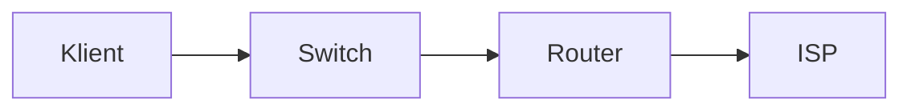
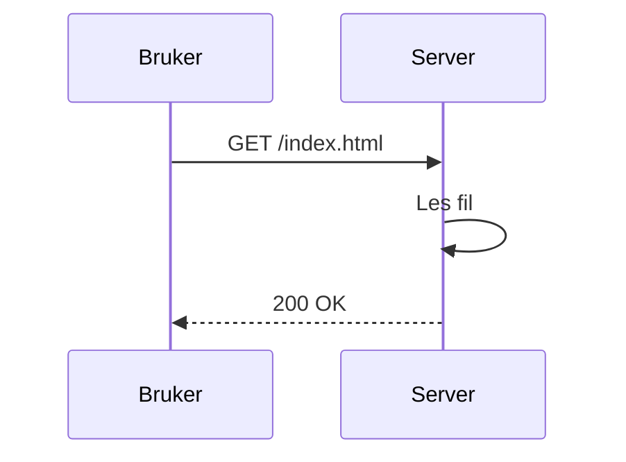

## Mermaid-diagram

```mermaid
flowchart LR
  A[Klient] --> B[Switch]
  B --> C[Router]
  C --> D[ISP]
```

```mermaid
sequenceDiagram
  Bruker->>Server: GET /index.html
  Server->>Server: Les fil
  Server-->>Bruker: 200 OK
```

